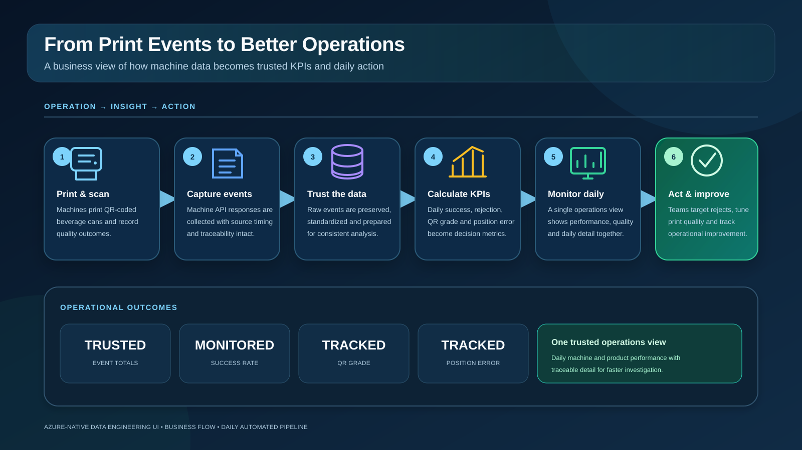
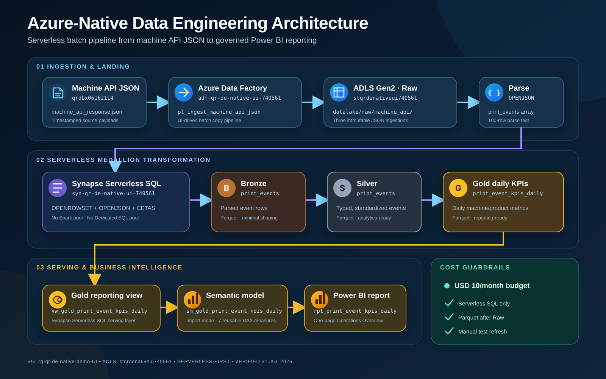
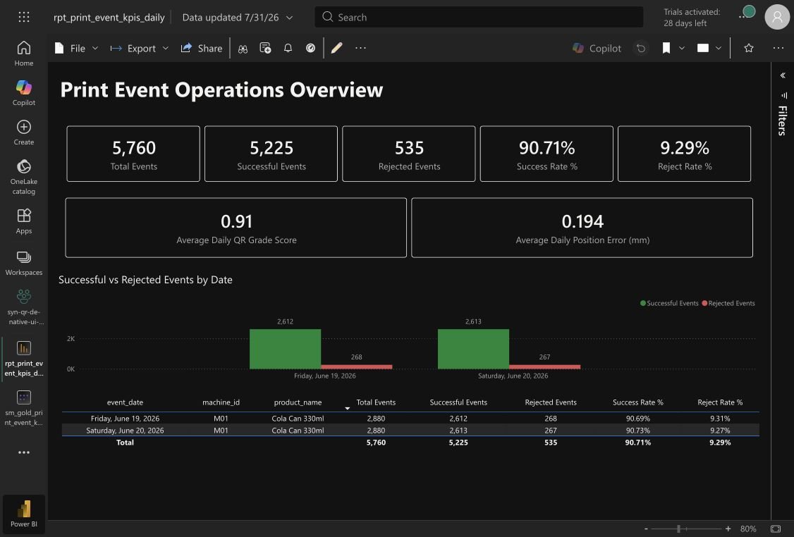

# Azure-Native Data Engineering UI

> Source of truth for the Azure-native batch data engineering and Power BI demonstration project.

**Status:** MVP complete  
**Implementation style:** Azure portal and service UIs  
**Cost strategy:** Serverless daily orchestration; no Spark or Dedicated SQL pool

## 1. Project objective

Build a cost-conscious Azure-native data engineering workflow that:

1. Ingests machine API JSON files.
2. Preserves the source payload in an ADLS Gen2 Raw layer.
3. Parses the `print_events` JSON array with Synapse Serverless SQL.
4. Produces Bronze, Silver, and Gold data as Parquet.
5. Exposes a Gold reporting view.
6. Serves reusable DAX measures through a Power BI semantic model.
7. Presents a one-page operations report for print-event KPIs.
8. Runs ingestion, transformation, and semantic-model refresh on coordinated Bangkok-time schedules.

## 2. Architecture

### Business flow



### Technical architecture



Verified Power BI lineage:

```text
Synapse -> sm_gold_print_event_kpis_daily -> rpt_print_event_kpis_daily
```

## 3. Azure resources

| Component | Resource / object | Purpose |
|---|---|---|
| Resource group | `rg-qr-de-native-demo-UI` | Project boundary |
| Azure budget | USD 10/month | Cost guardrail |
| ADLS Gen2 | `stqrdenativeui740561` | Data lake storage |
| Container | `datalake` | Raw and medallion data |
| Shared source function | `func-qr-daily-740561` | Writes one timestamped machine API JSON delivery to the shared source lake each day |
| Azure Data Factory | `adf-qr-de-native-ui-740561` | Batch ingestion |
| ADF pipeline | `pl_ingest_machine_api_json` | Incrementally copies machine API JSON to Raw using a last-modified UTC window |
| ADF trigger | `tr_daily_machine_api_schedule_1200_bkk` | Active daily schedule at 12:00 Asia/Bangkok |
| Synapse workspace | `syn-qr-de-native-ui-740561` | Serverless SQL transformation and serving |
| Synapse procedure | `dbo.usp_process_machine_api_incremental` | Produces date-partitioned Bronze, Silver, and Gold Parquet outputs |
| Power BI linked service | `ls_powerbi_qr_native_demo` | Synapse-to-Power BI workspace link |
| Power BI workspace | `syn-qr-de-native-ui-740561` | BI artifacts |

The Azure subscription ID is intentionally excluded so this document can be made public later.

## 4. Data lake layout

```text
datalake/
├── raw/
│   └── machine_api/
│       └── <ingestion_timestamp>/
│           └── machine_api_response.json
├── bronze/
│   └── print_events/
│       └── run_20260731_01/
│           └── *.parquet
├── silver/
│   └── print_events/
│       └── run_20260731_01/
│           └── *.parquet
└── gold/
    └── print_event_kpis_daily/
        └── run_20260731_01/
            └── *.parquet
```

Raw ingestion copies `machine_api_response.json` files from the shared source lake into timestamped folders under:

```text
datalake/raw/machine_api/<timestamp>/
```

Duplicate source deliveries are retained in Bronze for lineage, while Silver
deduplicates them by `event_id`. Gold and Power BI therefore expose evolving
business-event totals without double-counting repeated source deliveries.

## 5. Medallion responsibilities

### Raw

- Immutable source JSON.
- Preserves the original machine API response.
- Stored by ingestion timestamp for traceability.

### Bronze

- Expands the `print_events` array into tabular event rows.
- Retains source-level event attributes with minimal transformation.
- Preserves duplicate source deliveries and ingestion lineage.
- Stored as Parquet to reduce repeated JSON scanning.

### Silver

- Applies data types and standardized field names.
- Deduplicates events by `event_id` using the latest source folder/load.
- Produces analytics-ready print-event records.
- Supports clean downstream aggregation.

### Gold

- Aggregates print-event KPIs by day, machine, and product.
- Stores reporting-ready Parquet.
- Feeds the Synapse reporting view and Power BI semantic model.

### Print-event quality rule

The shared source marks an event as rejected when any one of these conditions
is true:

```text
print_status != "PRINTED"
OR qr_read_success != 1
OR ABS(position_error_mm) > 0.45
```

A successful event must therefore be printed, readable by the QR reader, and
within the 0.45 mm position-error tolerance. `qr_grade_score` is reported as a
quality indicator but is not part of the current reject decision. The source
currently provides only the Boolean `is_reject` result, not a separate
`reject_reason` field.

## 6. Synapse Serverless SQL

Only the built-in **Serverless SQL** endpoint is used.

Not used:

- Apache Spark pools
- Dedicated SQL pools

### Verified SQL artifacts

| Script / object | Purpose | Status |
|---|---|---|
| `sql_00_inspect_raw_json` | Inspect Raw JSON with Serverless SQL | Complete |
| `OPENJSON` parsing query | Expand the nested `print_events` array | Complete |
| Bronze Parquet transformation | Write parsed events to Bronze | Complete |
| Silver Parquet transformation | Clean and type event records | Complete |
| Gold Parquet transformation | Aggregate daily KPI records | Complete |
| `sql_06_create_gold_reporting_view` | Create the Power BI-facing Gold view | Complete |
| `sql_07_incremental_partition_template` | Document date-partitioned Bronze, Silver, and Gold CETAS patterns | Complete |
| `sql_08_create_scalable_gold_view` | Read all Gold Parquet partitions recursively | Complete and executed |
| `sql_09_create_incremental_medallion_procedure` | Process each scheduled source delivery into date-partitioned medallion outputs | Complete and deployed |
| `vw_gold_print_event_kpis_daily` | Reporting view over Gold Parquet | Complete |

### Showcase SQL exports

The repository includes a documented, sequential Serverless SQL implementation:

1. [`00_setup_serverless_objects.sql`](sql/00_setup_serverless_objects.sql)
2. [`01_inspect_raw_json.sql`](sql/01_inspect_raw_json.sql)
3. [`02_parse_print_events.sql`](sql/02_parse_print_events.sql)
4. [`03_create_bronze_parquet.sql`](sql/03_create_bronze_parquet.sql)
5. [`04_create_silver_parquet.sql`](sql/04_create_silver_parquet.sql)
6. [`05_create_gold_parquet.sql`](sql/05_create_gold_parquet.sql)
7. [`06_create_gold_reporting_view.sql`](sql/06_create_gold_reporting_view.sql)
8. [`07_incremental_partition_template.sql`](sql/07_incremental_partition_template.sql)
9. [`08_create_scalable_gold_view.sql`](sql/08_create_scalable_gold_view.sql)

Scripts 03-08 match the SQL artifacts published in Synapse Studio. Scripts
00-02 remain documented showcase versions for setup, inspection, and preview.

### Incremental orchestration

The published ADF pipeline now requires two string parameters:

```text
window_start_utc
window_end_utc
```

They drive the Copy activity's **Filter by last modified** settings, preventing
the normal incremental run from rescanning every source file. The Synapse
procedure writes each event date to immutable paths such as:

```text
bronze/print_events/event_date=YYYY-MM-DD/run_<run_id>/
silver/print_events/event_date=YYYY-MM-DD/run_<run_id>/
gold/print_event_kpis_daily/event_date=YYYY-MM-DD/run_<run_id>/
```

The procedure derives the ingestion date, event date, and run key from the ADF
schedule. CETAS output locations are unique per scheduled run. The stable Gold
view recursively reads Parquet below
`gold/print_event_kpis_daily/`, so the semantic model keeps the same source view.

The active trigger configuration is:

```text
Name:          tr_daily_machine_api_schedule_1200_bkk
Type:          Schedule
Frequency:     Daily at 12:00
Time zone:     SE Asia Standard Time
Runtime state: Started
```

The trigger passes its scheduled time as `window_end_utc` and derives
`window_start_utc` by subtracting 24 hours.

## 7. Gold reporting schema

Verified fields exposed by `vw_gold_print_event_kpis_daily`:

| Field | Meaning |
|---|---|
| `event_date` | KPI date |
| `machine_id` | Machine identifier |
| `product_id` | Product identifier |
| `product_name` | Product name |
| `total_events` | Total print events |
| `printed_events` | Printed-event count from Gold |
| `successful_events` | Successful events |
| `rejected_events` | Rejected events |
| `failed_events` | Failed events |
| `qr_read_failures` | QR-read failure count |
| `success_rate_pct` | Gold success-rate percentage |
| `reject_rate_pct` | Gold reject-rate percentage |
| `avg_qr_grade_score` | Average QR grade score |
| `avg_abs_position_error_mm` | Average absolute position error in millimetres |
| `first_event_ts` | First event timestamp in the group |
| `last_event_ts` | Last event timestamp in the group |
| `gold_loaded_utc` | Gold load timestamp |

## 8. Power BI implementation

### Workspace

```text
syn-qr-de-native-ui-740561
```

Workspace description:

```text
Power BI reporting workspace for the Azure-native QR data engineering demo using Synapse Serverless SQL Gold KPIs.
```

### Semantic model

```text
sm_gold_print_event_kpis_daily
```

Source table:

```text
vw_gold_print_event_kpis_daily
```

Storage mode:

```text
Import
```

Display folder for custom measures:

```text
DAX Measures
```

### DAX measures

Reusable semantic-model artifacts:

- [`dax-measures.dax`](semantic/dax-measures.dax) — executable validation query
  containing all seven measure definitions.
- [`semantic-model.tmdl`](semantic/semantic-model.tmdl) — showcase TMDL
  representation including formats and the `DAX Measures` display folder.

```DAX
Total Events =
SUM ( vw_gold_print_event_kpis_daily[total_events] )

Successful Events =
SUM ( vw_gold_print_event_kpis_daily[successful_events] )

Rejected Events =
SUM ( vw_gold_print_event_kpis_daily[rejected_events] )

Success Rate % =
DIVIDE ( [Successful Events], [Total Events], 0 )

Reject Rate % =
DIVIDE ( [Rejected Events], [Total Events], 0 )

Average Daily QR Grade Score =
AVERAGE ( vw_gold_print_event_kpis_daily[avg_qr_grade_score] )

Average Daily Position Error (mm) =
AVERAGE ( vw_gold_print_event_kpis_daily[avg_abs_position_error_mm] )
```

Formatting:

- Count measures: whole number with thousands separator.
- Rate measures: percentage with two decimal places.
- QR grade score: decimal.
- Position error: decimal in millimetres.

### Report

```text
rpt_print_event_kpis_daily
```

Report design: one-page **Print Event Operations Overview**

Layout:

1. Report title.
2. Operational KPI cards.
3. Quality KPI cards.
4. Clustered column chart: Successful vs Rejected Events by Date.
5. Daily detail table at the bottom.

Visual standards:

- Font: Segoe UI
- Dark report theme
- Successful events: `#34A853`
- Rejected events: `#E15759`
- Exact data labels with no automatic `K` abbreviation
- Categorical date axis

## 9. Report output

The report and lineage are published in the Power BI workspace. KPI totals and
available event dates evolve automatically as scheduled source deliveries are
processed.



*Power BI Reading view illustrating the report layout. Values in the live
report reflect the latest successfully processed Gold partitions.*

The report presents total, successful, and rejected events; success and reject
rates; QR quality indicators; daily comparisons; and machine/product detail.

## 10. Daily orchestration

The automated sequence uses Bangkok time:

```text
11:45  Azure Function writes the shared source JSON
12:00  ADF copies the latest source window and invokes Synapse Serverless SQL
12:30  Power BI refreshes sm_gold_print_event_kpis_daily
```

The ADF pipeline executes two ordered activities:

1. `Copy_machine_api_json_to_raw`
2. `Run_synapse_incremental_medallion`, after the copy succeeds

The Power BI semantic model uses Import storage mode and has a daily 12:30
schedule in `SE Asia Standard Time`, with failure email enabled.

### Failure observability

The Azure-native workflow uses email-only, notification-only monitoring:

| Scope | Alert rule | Condition | Notification |
|---|---|---|---|
| Shared source Function `func-qr-daily-740561` | `ar-qr-function-no-execution-24h` | Total `FunctionExecutionCount < 1` over 24 hours, evaluated every 5 minutes | `ag-qr-function-email-alerts` |
| ADF pipeline `pl_ingest_machine_api_json` | `ar-qr-adf-pipeline-failed` | Total failed pipeline runs greater than 0 over 5 minutes, evaluated every 5 minutes | `ag-qr-adf-email-alerts` |

Both rules are enabled at severity 2. They send email notifications only and
do not retry, rerun, or backfill the Function, ADF pipeline, or Synapse work.

## 11. Cost controls

- Azure budget: USD 10/month.
- Synapse Serverless SQL only.
- No Spark pool.
- No Dedicated SQL pool.
- Parquet used after Raw to reduce scanned data.
- Daily ADF schedule at 12:00 Asia/Bangkok.
- Daily Power BI semantic-model refresh at 12:30 Asia/Bangkok.
- No Power BI app creation for the MVP.

## 12. Security and GitHub readiness

Do not commit:

- Subscription IDs
- Access keys
- SAS tokens
- Connection strings
- Credentials
- Local browser/session data

Current repository structure:

```text
Azure-Native-Data-Engineering-UI/
├── README.md
├── sql/
│   ├── 00_setup_serverless_objects.sql
│   ├── 01_inspect_raw_json.sql
│   ├── 02_parse_print_events.sql
│   ├── 03_create_bronze_parquet.sql
│   ├── 04_create_silver_parquet.sql
│   ├── 05_create_gold_parquet.sql
│   ├── 06_create_gold_reporting_view.sql
│   ├── 07_incremental_partition_template.sql
│   └── 08_create_scalable_gold_view.sql
├── semantic/
│   ├── dax-measures.dax
│   └── semantic-model.tmdl
├── docs/
│   └── images/
│       ├── business-flow.svg
│       ├── power-bi-report.jpg
│       └── technical-flow.svg
```

## 13. Completion checklist

- [x] Resource group and budget
- [x] ADLS Gen2 and medallion folders
- [x] ADF ingestion pipeline
- [x] Timestamped Raw JSON ingestion
- [x] Raw JSON inspection
- [x] `print_events` parsing with `OPENJSON`
- [x] Bronze Parquet
- [x] Silver Parquet
- [x] Gold Parquet
- [x] Gold reporting view
- [x] Synapse-to-Power BI linked service
- [x] Power BI semantic model
- [x] Seven DAX measures grouped in `DAX Measures`
- [x] One-page Power BI operations report
- [x] Reading view validation
- [x] Lineage validation
- [x] Add showcase Synapse SQL scripts
- [x] Add DAX and TMDL semantic-model scripts
- [x] Add Business and Technical SVG architecture diagrams
- [x] Parameterize ADF ingestion by source last-modified UTC window
- [x] Enable the daily ADF schedule with parameter mapping
- [x] Add incremental date-partition template
- [x] Deploy the incremental Synapse medallion procedure
- [x] Create stable recursive Gold reporting view
- [x] Configure the daily Power BI semantic-model refresh
- [x] Configure email-only Function and ADF failure observability
- [x] Review for secrets, initialize Git, and publish the repository

## 14. Technical references

- [Query data storage with Synapse Serverless SQL](https://learn.microsoft.com/en-us/azure/synapse-analytics/sql/query-data-storage)
- [CREATE EXTERNAL TABLE AS SELECT (CETAS) in Synapse SQL](https://learn.microsoft.com/en-us/azure/synapse-analytics/sql/develop-tables-cetas)
- [Store query results from a serverless SQL pool](https://learn.microsoft.com/en-us/azure/synapse-analytics/sql/create-external-table-as-select)
- [Tabular Model Definition Language (TMDL)](https://learn.microsoft.com/en-us/analysis-services/tmdl/tmdl-overview)
